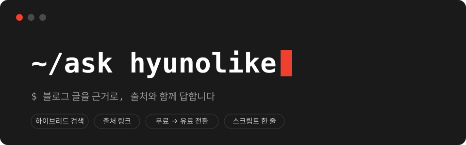
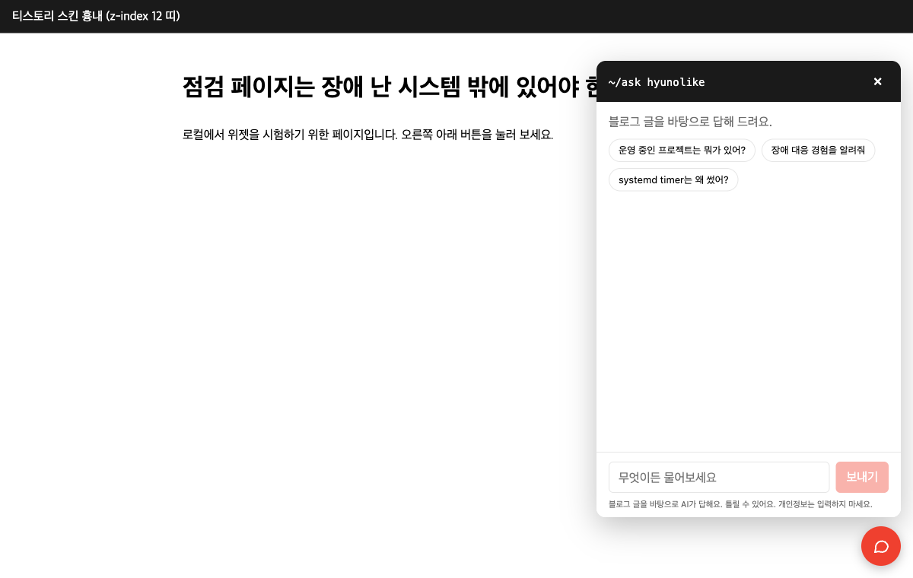
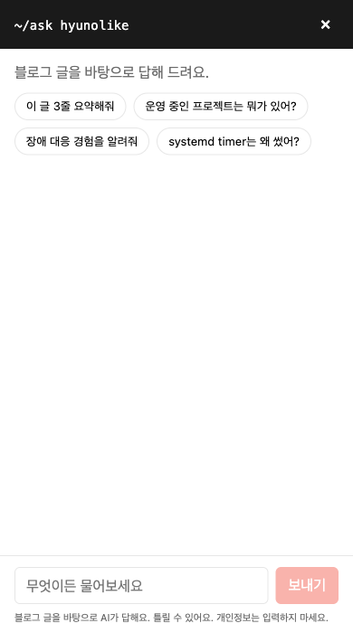
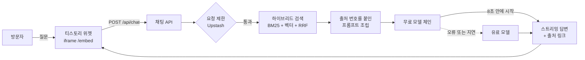
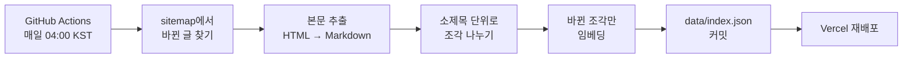

<div align="center">



<br>
<br>

**[hyunolike 기술 블로그](https://hyunolike.tistory.com)의 글을 근거로 답하고, 어느 글에서 가져왔는지 함께 알려주는 AI 채팅**


</div>

> 현재 상태: 구현을 마치고 배포를 준비하고 있습니다. 아래 화면은 로컬에서 띄운 것입니다.

<br>

## 프로젝트 소개 📝

기술 블로그에 글이 70개를 넘어가면서, 처음 온 사람이 원하는 글을 찾기가 어려워졌습니다. 채용 담당자는 "장애를 어떻게 대응했는지"를 알고 싶어 하고, 검색으로 들어온 방문자는 "systemd timer를 왜 썼는지"만 궁금합니다. 두 사람 모두 글 목록을 처음부터 훑어야 했습니다.

`blog-agent`는 블로그 오른쪽 아래에 채팅 버튼을 하나 답니다. 질문을 받으면 블로그 글에서 관련된 부분을 찾아 그 내용으로만 답하고, 근거가 된 글의 링크를 함께 보여줍니다. 글에 없는 내용은 지어내지 않고 "블로그에는 없는 내용"이라고 답합니다.

<br>

## 핵심 기능 ✨

### 1. 글에 있는 내용으로만 답합니다

답변의 문장마다 `[1]`처럼 출처 번호가 붙고, 번호를 누르면 해당 글로 이동합니다. 경력 기간이나 수치처럼 사람에 대한 사실은 글에 적힌 그대로만 씁니다.

### 2. 보고 있는 글을 알고 답합니다

글 페이지에서 채팅을 열면 "이 글 3줄 요약해줘" 같은 질문을 바로 할 수 있습니다. 지금 보고 있는 글이 항상 첫 번째 근거로 들어갑니다.

### 3. 기술 용어를 정확히 찾습니다

의미가 비슷한 글을 찾는 벡터 검색과 단어가 일치하는 글을 찾는 키워드 검색을 함께 씁니다. `RequiresMountsFor`나 `ORA-28040`처럼 정확히 일치해야 하는 용어도 놓치지 않습니다.

### 4. 무료 모델로 답하고, 안 되면 유료 모델이 이어받습니다

먼저 무료 모델에 요청하고, 8초 안에 답이 시작되지 않거나 오류가 나면 유료 모델로 넘깁니다. 모든 모델이 실패해도 검색된 관련 글 링크는 보여줍니다.

### 5. 스크립트 한 줄로 붙입니다

티스토리 스킨에 `<script>` 한 줄만 넣으면 됩니다. 채팅 화면은 iframe 안에서 돌아가서 블로그 스킨의 CSS와 서로 영향을 주지 않습니다.

<br>

## 화면 🖥️

| PC: 블로그 오른쪽 아래에서 열린 채팅 | 모바일: 글 페이지에서 열었을 때 |
| :---: | :---: |
|  |  |

<br>

## 기술 스택 💡

| 영역 | 기술 |
| --- | --- |
| 앱 | Next.js 16 (App Router), React 19, TypeScript 6 |
| AI | Vercel AI SDK 7, OpenRouter (답변 모델과 임베딩) |
| 검색 | 직접 구현한 BM25와 벡터 검색, RRF 결합 (별도 DB 없이 `data/index.json`) |
| 수집 | cheerio, turndown, GitHub Actions |
| 요청 제한 | Upstash Redis |
| 테스트 | Vitest |
| 배포 | Vercel |

<br>

## 구조 🏛

### 질문 한 번의 흐름



### 글이 인덱스가 되기까지



수집과 채팅은 `data/index.json` 파일 하나로만 연결됩니다. 수집이 실패해도 채팅은 마지막으로 만들어진 인덱스로 계속 동작합니다.

### 저장소 구조

```text
.
├── ingest/            # sitemap 읽기, 본문 추출, 조각 나누기, 인덱스 빌드
├── lib/               # 검색, 프롬프트, 모델 전환, 요청 제한
├── app/
│   ├── api/chat/      # 스트리밍 채팅 API
│   └── embed/         # iframe에 들어가는 채팅 화면
├── public/widget.js   # 티스토리 스킨이 불러가는 위젯
├── eval/              # 평가 30문항과 평가 스크립트
├── tests/             # 단위 테스트와 실제 글 HTML 테스트 데이터
└── docs/              # 설계 문서와 구현 계획
```

<br>

## 이렇게 만든 이유 🤔

#### 1. 벡터 DB를 두지 않았습니다

글 70여 개를 조각으로 나누면 수백 개 수준입니다. 이 정도는 파일 하나에 담아 메모리에서 전부 비교해도 몇 ms면 끝납니다. DB를 두면 관리할 대상과 콜드스타트만 늘어난다고 판단했습니다.

#### 2. 키워드 검색을 직접 만들었습니다

한국어 기술 글은 한글 문장 안에 영문 용어가 섞여 있습니다. 한글은 두 글자씩 끊어 색인하고 영문 용어는 단어 그대로 색인해서, 형태소 분석기 없이도 용어 검색이 정확하게 동작합니다.

#### 3. 모델 전환은 첫 글자가 나가기 전에만 합니다

답변이 절반쯤 나오다가 다른 모델의 답으로 바뀌면 읽는 사람이 더 혼란스럽습니다. 그래서 답이 시작된 뒤에 끊기면 모델을 바꾸지 않고 "다시 시도" 버튼을 보여줍니다.

#### 4. 공개 저장소라는 전제로 설계했습니다

시스템 프롬프트와 요청 제한 규칙은 누구나 읽을 수 있습니다. 숨겨야 안전한 구조는 만들지 않았고, 비용 상한은 코드가 아니라 OpenRouter 키의 사용 한도로 겁니다.

자세한 설계는 [설계 문서](docs/superpowers/specs/2026-09-29-blog-chat-agent-design.md)에, 작업 순서는 [구현 계획](docs/superpowers/plans/2026-09-29-blog-chat-agent.md)에 있습니다.

<br>

## 로컬 실행

```bash
npm ci
cp .env.example .env.local   # OPENROUTER_API_KEY, PAID_MODEL, FREE_MODELS 채우기
npm run ingest               # data/index.json 생성 (1~2분)
npm run dev                  # http://localhost:3000/dev-host.html 에서 위젯 확인
npm test
```

## 배포

1. **OpenRouter:** API 키를 만들고 키 설정에서 사용 한도(credit limit)를 겁니다. 무료 모델 하루 한도를 1,000회로 늘리려면 크레딧을 $10 이상 한 번 충전합니다.
2. **Upstash:** Redis 데이터베이스(무료)를 만들고 REST URL과 토큰을 복사합니다.
3. **Vercel:** 이 저장소를 import 하고 환경변수를 넣습니다.
   - `OPENROUTER_API_KEY`, `FREE_MODELS`, `PAID_MODEL`, `EMBEDDING_MODEL`
   - Vercel의 `EMBEDDING_MODEL`은 인덱스를 읽지 못했을 때만 쓰는 대비값입니다. 채팅은 `data/index.json`에 기록된 임베딩 모델로 질문을 임베딩하고, 두 값이 다르면 로그에 `embedding_model_mismatch`를 남깁니다.
   - `APP_ORIGIN` = 배포 주소(예: `https://blog-agent.vercel.app`)
   - `FRAME_ANCESTORS` = `https://hyunolike.tistory.com`
   - `UPSTASH_REDIS_REST_URL`, `UPSTASH_REDIS_REST_TOKEN`
   - Settings → Git에서 Fork Protection이 켜져 있는지 확인합니다.
4. **GitHub:** Settings → Secrets and variables → Actions
   - Secret `OPENROUTER_API_KEY`
   - Variable `EMBEDDING_MODEL`
   - Settings → Code security에서 Secret scanning push protection을 켭니다.
   - Actions 탭에서 `ingest` workflow를 한 번 수동 실행합니다.
5. **티스토리:** 스킨 편집 → HTML에서 `</body>` 바로 위에 넣습니다.
   ```html
   <script src="https://blog-agent.vercel.app/widget.js" defer></script>
   ```
   관리 → 꾸미기 → 모바일에서 "모바일 웹 자동 연결"이 꺼져 있어야 모바일에서도 위젯이 보입니다.

## 배포 전 체크리스트

- [ ] Vercel 환경변수 설정
- [ ] OpenRouter 키 사용 한도 확인
- [ ] Secret scanning push protection, Vercel Fork Protection 확인
- [ ] `curl -sI https://<배포 주소>/embed | grep -i content-security-policy` → `frame-ancestors https://hyunolike.tistory.com`
- [ ] `ingest` workflow 수동 실행 → `data/index.json` 커밋 → 재배포 확인
- [ ] 티스토리 PC와 모바일에서 열기, 닫기, 출처 링크 이동 확인
- [ ] 같은 IP로 11번 연속 질문해 요청 제한 안내 문구 확인
- [ ] OpenRouter 설정 → Privacy에서 무료 모델(데이터 정책) 사용이 허용돼 있는지 확인 (꺼져 있으면 무료 호출이 전부 유료로 넘어감)
- [ ] 저장소 기본 브랜치가 Vercel 프로덕션 브랜치와 같은지 확인 (매일 수집 커밋이 기본 브랜치로 들어감)
- [ ] FRAME_ANCESTORS를 바꾸면 재배포 필요 (빌드 시점에 읽음)

## 운영

- Vercel 로그에서 `"event":"chat"` 줄의 `tier`(free/paid)와 `fallbackReason`으로 유료 전환 비율을 봅니다.
- 유료 전환이 잦으면 `npm run eval:answers`로 무료 모델 후보를 다시 평가해 `FREE_MODELS`를 바꿉니다.
- 스킨을 바꾼 뒤 `ingest`가 `본문 추출 실패`로 멈추면 `ingest/extract.ts`의 `#article-view .contents_style` 선택자를 확인합니다.

<br>

## 만든 사람 👤

|  |
| :---: |
| [hyunolike](https://github.com/hyunolike) |
| [기술 블로그](https://hyunolike.tistory.com) |
